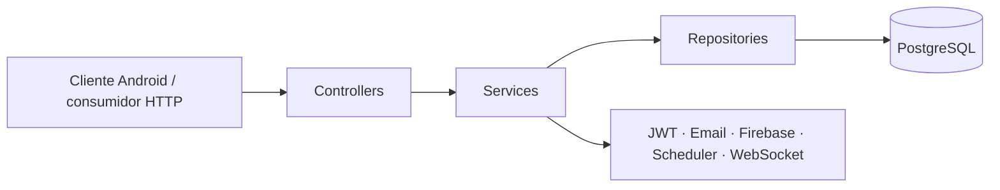

# AMANI API REST

Backend REST para la gestión de citas psicológicas, sesiones clínicas y seguimiento emocional en la plataforma AMANI.


<!-- TODO: confirmar si este repositorio tendrá imagen Docker o docker-compose versionado; no se han encontrado archivos Docker en el código actual. -->

> 📱 Android client: [amani-android](https://github.com/AmaniGrupo1/amani-android)

## Tabla de contenidos

- [Sobre AMANI](#sobre-amani)
- [Funcionalidades](#funcionalidades)
- [Arquitectura](#arquitectura)
- [Prerrequisitos](#prerrequisitos)
- [Instalación y ejecución](#instalación-y-ejecución)
- [Documentación de la API](#documentación-de-la-api)
- [Repositorio relacionado](#repositorio-relacionado)
- [Autores](#autores)
- [Licencia](#licencia)

## Sobre AMANI

AMANI es una plataforma de gestión de atención psicológica que conecta pacientes y psicólogos en un mismo flujo de trabajo. Este repositorio contiene la API REST desarrollada con Spring Boot, responsable de la autenticación, la lógica de negocio, el acceso a datos y la exposición de endpoints para la app móvil.

El sistema cubre el ciclo completo de atención: registro de usuarios, asignación de psicólogos, agenda de citas, sesiones, historial clínico, mensajería, diario emocional, progreso emocional y cuestionarios iniciales.

El proyecto forma parte del Proyecto de Fin de Ciclo (PFC) del grado de Desarrollo de Aplicaciones Multiplataforma (DAM) en IES Enrique Tierno Galván.

## Funcionalidades

### 🧑 Paciente

- Registro y autenticación JWT (`/auth/login`, `/auth/register-paciente`).
- Gestión de perfil de paciente, usuario y ajustes personales.
- Consulta y reserva de citas, además de acceso a agenda personal.
- Gestión de sesiones, historial clínico, direcciones y datos asociados.
- Seguimiento emocional mediante diario emocional y progreso emocional.
- Mensajería con lectura y consulta de bandejas enviadas/recibidas.
- Acceso a psicólogos asignados y envío de respuestas del test inicial.

### 🧠 Psicólogo

- Consulta y edición de su ficha profesional y perfil público.
- Gestión de pacientes asignados.
- Gestión de sesiones clínicas e historiales.
- Consulta del diario emocional, direcciones y progreso emocional de pacientes.
- Gestión de citas, disponibilidad, agenda, cancelaciones y días no disponibles.
- Mensajería con pacientes.
- Consulta de respuestas del cuestionario inicial y subida de foto de perfil.

### 🔧 Admin

- Alta de administradores y psicólogos desde autenticación.
- Alta, edición y consulta administrativa de pacientes y psicólogos.
- Asignación de psicólogos a pacientes.
- Administración de citas, sesiones, historiales, direcciones y progreso emocional.
- Gestión de archivos asociados a sesiones.
- Gestión de mensajes y preguntas del test inicial.

## Arquitectura

### Estructura principal

```text
src/main/java/com/amani/amaniapirest
├── AmaniApirestApplication.java
├── configuration/
│   ├── AsyncConfig.java
│   ├── FirebaseConfig.java
│   ├── JwtAuthFilter.java
│   ├── JwtUtil.java
│   ├── OpenApiConfig.java
│   ├── SecurityConfig.java
│   ├── WebConfig.java
│   └── WebSocketConfig.java
├── controllers/
│   ├── chat/
│   ├── controladorAdministador/
│   ├── controladorPaciente/
│   ├── controladorPsicologo/
│   ├── login/
│   ├── preguntasController/
│   ├── profileController/
│   └── situacionController/
├── dto/
│   ├── chat/
│   ├── dtoAdmin/
│   ├── dtoAgenda/
│   ├── dtoPaciente/
│   ├── dtoPregunta/
│   ├── dtoPsicologo/
│   ├── loginDTO/
│   ├── profile/
│   └── situacion/
├── enums/
├── events/
├── listeners/
├── mappers/
├── models/
│   └── modelPreguntasInicial/
├── repositories/
├── repository/
│   └── repositoryRespuesta/
└── services/
    ├── paciente/
    ├── profile/
    ├── psicologo/
    ├── serviceAdmin/
    ├── servicePacientePregunta/
    └── serviciosLogin/
```

### Flujo principal



### Capas

- **Controllers**: exponen endpoints REST y separan los flujos de paciente, psicólogo y administración.
- **Services**: concentran la lógica de negocio, validaciones, eventos de dominio y casos de uso.
- **Repositories**: encapsulan el acceso a datos JPA hacia PostgreSQL.
- **Configuration**: define seguridad JWT, OpenAPI, scheduling, asincronía, WebSocket y configuración de Firebase.
- **DTOs / Mappers / Models**: modelan las entidades persistentes y los contratos de entrada/salida.

## Prerrequisitos

- **JDK 21**
- **Maven Wrapper** incluido (`./mvnw`) o Maven compatible con el proyecto
- **PostgreSQL** accesible desde la aplicación (el proyecto usa el driver JDBC `org.postgresql:postgresql:42.7.10`)
- **Cuenta/credenciales de Firebase Admin SDK** en `src/main/resources/serviceAccountKey.json`
- **Servidor SMTP** si quieres usar envío real de correos

## Instalación y ejecución

1. **Clona el repositorio** y entra en la carpeta del proyecto.
2. **Crea la base de datos y el esquema** que espera la aplicación.
3. **Sobrescribe la configuración de `application.properties`** con variables de entorno de Spring Boot.
4. **Coloca un `serviceAccountKey.json` válido** en `src/main/resources/` para habilitar Firebase Cloud Messaging.
5. **Arranca la API** con Maven Wrapper.

### Variables de entorno / configuración

Estas son las claves configurables detectadas en `src/main/resources/application.properties`. Los valores de ejemplo son seguros para documentación y deben adaptarse a tu entorno local:

```bash
export SPRING_APPLICATION_NAME=amani-apirest
export SERVER_PORT=8080
export SERVER_ADDRESS=0.0.0.0

export SPRING_DATASOURCE_URL=jdbc:postgresql://localhost:5433/postgres
export SPRING_DATASOURCE_USERNAME=your_db_user
export SPRING_DATASOURCE_PASSWORD=your_db_password
export SPRING_DATASOURCE_DRIVER_CLASS_NAME=org.postgresql.Driver

export SPRING_JPA_HIBERNATE_DDL_AUTO=validate
export SPRING_JPA_SHOW_SQL=true
export SPRING_JPA_PROPERTIES_HIBERNATE_DIALECT=org.hibernate.dialect.PostgreSQLDialect
export SPRING_JPA_PROPERTIES_HIBERNATE_DEFAULT_SCHEMA=psicologia_app
export SPRING_JPA_PROPERTIES_HIBERNATE_FORMAT_SQL=true

export SPRING_MAIL_HOST=localhost
export SPRING_MAIL_PORT=1025
export SPRING_MAIL_USERNAME=noreply@example.com
export SPRING_MAIL_PROPERTIES_MAIL_SMTP_AUTH=false
export SPRING_MAIL_PROPERTIES_MAIL_SMTP_STARTTLS_ENABLE=false

export SPRINGDOC_SWAGGER_UI_PATH=/docs
export SPRINGDOC_SWAGGER_UI_OPERATIONSSORTER=method

export FILE_UPLOAD_DIR=uploads
export SPRING_SERVLET_MULTIPART_MAX_FILE_SIZE=5MB
export SPRING_SERVLET_MULTIPART_MAX_REQUEST_SIZE=10MB

export JWT_SECRET=your_jwt_secret_here
export JWT_EXPIRATION=86400000

export LOGGING_LEVEL_ROOT=WARN
export LOGGING_LEVEL_COM_AMANI_AMANIAPIREST=DEBUG
export LOGGING_LEVEL_ORG_SPRINGFRAMEWORK_WEB=INFO
export LOGGING_LEVEL_ORG_SPRINGFRAMEWORK_WEB_SERVLET_DISPATCHERSERVLET=WARN
export LOGGING_LEVEL_ORG_SPRINGFRAMEWORK_SECURITY=WARN
export LOGGING_LEVEL_ORG_HIBERNATE_SQL=DEBUG
export LOGGING_LEVEL_ORG_HIBERNATE_ORM_JDBC_BIND=TRACE
export LOGGING_LEVEL_COM_ZAXXER_HIKARI=WARN
export LOGGING_PATTERN_CONSOLE='%clr(%d{HH:mm:ss.SSS}){faint} %clr(%-5level) %clr([%15.15t]){faint} %clr(%-40.40logger{39}){cyan} : %msg%n'
```

### Base de datos esperada

El `application.properties` apunta por defecto a:

- **Host**: `localhost`
- **Puerto**: `5433`
- **Base de datos**: `postgres`
- **Schema**: `psicologia_app`

<!-- TODO: confirmar si `src/main/resources/amani.sql` es el script oficial de inicialización para desarrollo local. -->

### Ejecución

```bash
./mvnw spring-boot:run
```

### Verificación básica

```bash
./mvnw test
```

> Nota: en esta copia del repositorio, `mvn test` falla actualmente durante el procesado de recursos por un `MalformedInputException` al leer `src/main/resources/application.properties`, por lo que esa incidencia parece previa a esta documentación.

## Documentación de la API

- **Swagger UI**: `http://localhost:8080/docs`
- **OpenAPI JSON**: `http://localhost:8080/v3/api-docs`
- **Autenticación**: JWT Bearer obtenido desde `POST /auth/login`
- **WebSocket STOMP**: endpoint `/ws`, prefijo de aplicación `/app`, broker simple `/topic` y `/queue`

### Endpoints públicos / compartidos

| Controlador | Base `@RequestMapping` | Notas |
|---|---|---|
| `AuthController` | `/auth` | Login y registro de usuarios. |
| `SituacionController` | `/api/situaciones` | Consulta de situaciones. |

### Endpoints de paciente

| Controlador | Base `@RequestMapping` |
|---|---|
| `AjusteController` | `/api/ajustes` |
| `CitaController` | `/api/citas` |
| `DiarioEmocionController` | `/api/diario-emocion` |
| `DireccionController` | `/api/direcciones` |
| `HistorialClinicoController` | `/api/historial-clinico` |
| `MensajeController` | `/api/mensajes` |
| `PacienteController` | `/api/pacientes` |
| `ProgresoEmocionalController` | `/api/progreso-emocional` |
| `PsicologoPacienteController` | `/api/paciente/psicologos` |
| `SesionPacienteController` | `/api/paciente/sesiones` |
| `UsuarioController` | `/api/usuarios` |
| `PreguntaPacienteController` | `/api/paciente/preguntas` |

### Endpoints de psicólogo

| Controlador | Base `@RequestMapping` |
|---|---|
| `CitaControladorPsicologo` | `/api/citas` |
| `DiarioEmocionPsicologoController` | `/api/diario/psicologo` |
| `DireccionPsicologoController` | `/api/direcciones/psicologo` |
| `HistorialClinicoPsicologoController` | `/api/psicologo/historial` |
| `MensajePsicologoController` | `/api/psicologo/mensajes` |
| `PacientePsicologoController` | `/api/psicologo/pacientes` |
| `ProgresoEmocionalPsicologoController` | `/api/psicologo/progreso-emocional` |
| `PsicologoSelfController` | `/api/psicologo` |
| `SesionPsicologoController` | `/api/psicologo/sesiones` |
| `UsuarioPsicologoController` | `/api/psicologo/usuario` |
| `RespuestaPsicologoController` | `/api/psicologo/respuestas` |
| `ProfileController` | `/api/psicologo` |

### Endpoints de administración

| Controlador | Base `@RequestMapping` | Notas |
|---|---|---|
| `ArchivoController` | `/api/archivos` | Gestión de archivos por sesión. |
| `CitaControladorAdmin` | `/api/citas` | Los métodos administrativos cuelgan de `/admin`. |
| `DiarioEmocionAdminController` | `/api/diario/admin` | Consulta administrativa. |
| `DireccionAdminController` | `/api/direcciones/admin` | CRUD administrativo. |
| `HistorialClinicoAdminController` | `/api/admin/historial` | CRUD administrativo. |
| `MensajeAdminController` | `/api/admin/mensajes` | Bandejas y marcado de lectura. |
| `PacienteAdminControlador` | `/api/pacientes` | Los métodos administrativos cuelgan de `/admin`. |
| `ProgresoEmocionalAdminController` | `/api/admin/progreso-emocional` | CRUD administrativo. |
| `PsicologoAdminController` | `/api/admin/psicologos` | Alta y asignación de psicólogos. |
| `SesionAdminController` | `/api/admin/sesiones` | CRUD administrativo. |
| `PreguntaAdminController` | `/api/admin/preguntas` | Gestión del cuestionario inicial. |
| `AuthController` | `/auth` | Registro de admin y psicólogo. |

## Repositorio relacionado

La app móvil que consume esta API vive en el repositorio **AmaniGrupo1/amani-android**. Allí se implementa la interfaz Android en Kotlin + Jetpack Compose y se conecta con este backend para autenticación, agenda, mensajería y seguimiento clínico.

- Android client: [https://github.com/AmaniGrupo1/amani-android](https://github.com/AmaniGrupo1/amani-android)

## Autores

| Nombre | GitHub |
|---|---|
| Iván | `@placeholder` |
| Felix Patricio Peñafiel Burgos | `@placeholder` |
| Alejandro García Kanouka | `@placeholder` |
| Diego Hernández Cañavate (tutor) | `@placeholder` |

## Licencia

Este proyecto se distribuye bajo la licencia MIT.

```text
MIT License

Copyright (c) 2026 AMANI

Permission is hereby granted, free of charge, to any person obtaining a copy
of this software and associated documentation files (the "Software"), to deal
in the Software without restriction, including without limitation the rights
to use, copy, modify, merge, publish, distribute, sublicense, and/or sell
copies of the Software, and to permit persons to whom the Software is
furnished to do so, subject to the following conditions:

The above copyright notice and this permission notice shall be included in all
copies or substantial portions of the Software.

THE SOFTWARE IS PROVIDED "AS IS", WITHOUT WARRANTY OF ANY KIND, EXPRESS OR
IMPLIED, INCLUDING BUT NOT LIMITED TO THE WARRANTIES OF MERCHANTABILITY,
FITNESS FOR A PARTICULAR PURPOSE AND NONINFRINGEMENT. IN NO EVENT SHALL THE
AUTHORS OR COPYRIGHT HOLDERS BE LIABLE FOR ANY CLAIM, DAMAGES OR OTHER
LIABILITY, WHETHER IN AN ACTION OF CONTRACT, TORT OR OTHERWISE, ARISING FROM,
OUT OF OR IN CONNECTION WITH THE SOFTWARE OR THE USE OR OTHER DEALINGS IN THE
SOFTWARE.
```
