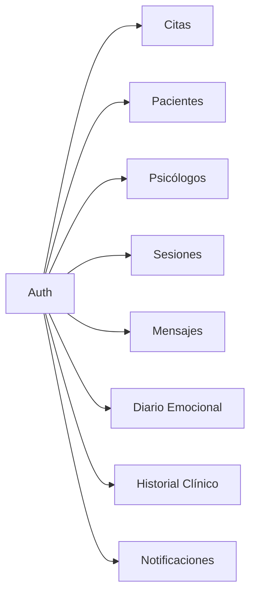

# API REST

Esta sección documenta la API REST de AMANI: endpoints, modelos de datos y la especificación OpenAPI.

!!! tip "Swagger UI en vivo"
    En entornos locales, accede a la interfaz interactiva en `http://localhost:8080/swagger-ui.html`.

---

## 📖 Contenido

- [Referencia de endpoints](endpoints.md) — Listado de recursos, métodos HTTP, rutas y parámetros.
- [Modelos de datos](models.md) — DTOs, entidades JPA y contratos de request/response.
- [OpenAPI (Swagger)](openapi.md) — Visualización inline de la especificación OpenAPI generada.

---

## 🔐 Autenticación

Todos los endpoints (salvo `/auth/**`) requieren un token JWT en la cabecera:

```http
Authorization: Bearer <token_jwt>
```

El token se obtiene tras iniciar sesión en `/auth/login`.

| Rol | Descripción |
|---|---|
| `ADMIN` | Gestión completa de usuarios, citas, contenido y sistema |
| `PSICOLOGO` | Agenda, pacientes asignados, historial clínico |
| `PACIENTE` | Citas propias, diario emocional, progreso, mensajes |

---

## 🌐 Base URL

| Entorno | URL |
|---|---|
| Local | `http://localhost:8080/api` |
| Producción (GCP) | `https://amani-api-xxxxx-ez.a.run.app/api` |

---

## 📊 Recursos principales


