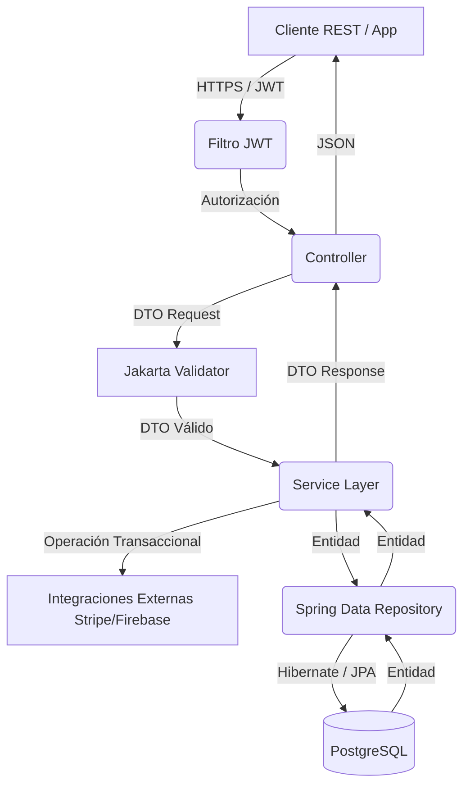
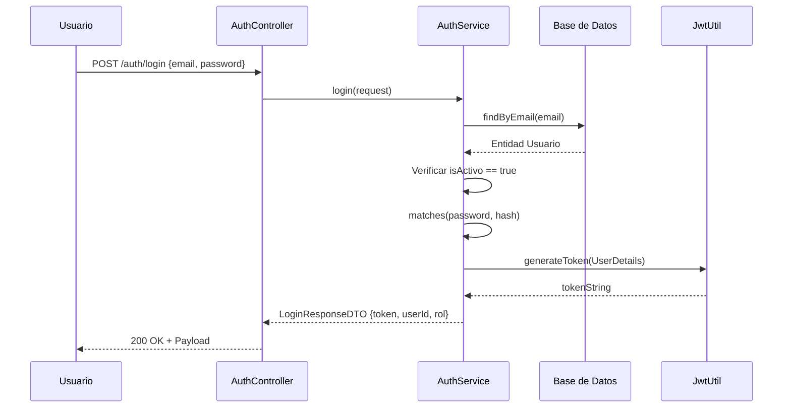
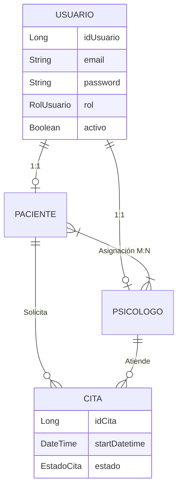

# Diagramas de Arquitectura

## Diagrama de Flujo (Peticiones REST)

El siguiente diagrama detalla cómo viaja una petición desde el cliente web/móvil hasta llegar a la capa de base de datos.

## Flujo de Autenticación (Login)

## Relación de Entidades Base (Roles)

