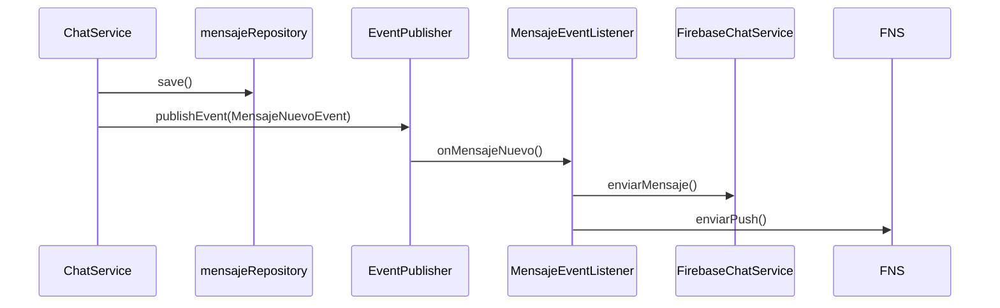

# Changelog

Registro de cambios de integración y evolución del proyecto AMANI.

---

## Fase 2 — Correcciones Firebase RTDB + Chat

### Resumen

Corrección de la arquitectura de doble escritura, resolución del endpoint `/api/chats/conversations`, actualización de reglas de Firebase y clasificación de código muerto.

### Cambios principales

#### A. Doble escritura RTDB — CORREGIDO

`ChatService.sendMessage()` ahora publica `MensajeNuevoEvent` (evento de dominio) en lugar de llamar directamente a `FirebaseChatService`. El `MensajeEventListener` es la **única vía** de escritura a RTDB.

#### B. `/api/chats/conversations` — CORREGIDO

Ahora inyecta `UsuarioRepository`, extrae el email del JWT y resuelve el `idUsuario` con `usuarioRepository.findByEmail()`.

#### C. Reglas de Firebase — ACTUALIZADO

Las reglas propuestas permiten acceso autenticado a:
- `/chats/{roomId}/messages` — lectura/escritura
- `/typing/{roomId}/{userId}` — lectura; escritura propia
- `/users/{userId}/isOnline` y `lastSeen` — lectura; escritura propia

!!! warning "Requiere confirmación"
    Estas reglas deben desplegarse manualmente en Firebase Console.

#### D. `ChatWebSocketController` — CLASIFICADO

Vacío (0 bytes), sin referencias. **Candidato para eliminación**.

### Archivos modificados

| Archivo | Cambio |
|---|---|
| `services/chat/ChatService.java` | Elimina dependencia directa de `FirebaseChatService`; usa `ApplicationEventPublisher` |
| `controllers/chat/ChatController.java` | Inyecta `UsuarioRepository`; resuelve userId desde JWT |
| `resources/firebase-rules.json` | Reglas actualizadas para acceso autenticado |
| `services/chat/ChatServiceTest.java` | Actualizado para reflejar nueva arquitectura |

---

## Fase 1 — Integración Firebase Realtime Database

### Resumen

Integración inicial de Firebase Realtime Database para chat en tiempo real, Firebase Cloud Messaging (FCM) para notificaciones push y Firebase Auth para tokens.

### Componentes añadidos

- `FirebaseConfig.java` — Inicialización de Firebase Admin SDK
- `FirebaseChatService.java` — Escritura/lectura en RTDB
- `FirebaseNotificationService.java` — Envío de push via FCM
- `MensajeEventListener.java` — Listener de eventos de dominio
- `FirebaseAuthController.java` — Intercambio de token Firebase por JWT propio

### Decisión arquitectónica pendiente

La app Android escribe directamente en RTDB sin pasar por el backend. Los mensajes enviados desde Android **NO se persisten en PostgreSQL**.

!!! danger "Decisión pendiente"
    Para backend-first estricto, la app Android debe usar `POST /api/chats/messages` y dejar que el backend publique en RTDB.

---

## Anteriores

Cambios previos a la integración Firebase documentados en commits del repositorio.
