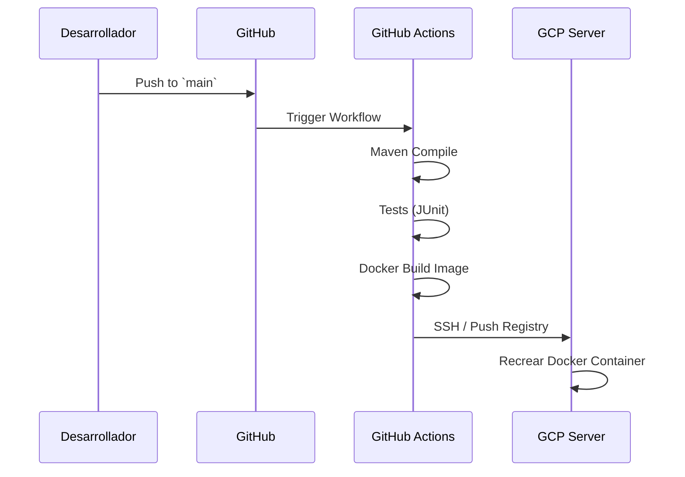

# Integración y Despliegue Continuo (CI/CD)

El pipeline de Amani se basa en flujos declarativos de **GitHub Actions** localizados en `.github/workflows/`. Este acercamiento asegura un "single source of truth" respecto al código, detectando degradaciones tan pronto como los pull requests son recibidos.

## Etapas del Pipeline

1. **Build & Test:** En cada push hacia las ramas de desarrollo (`main` o `develop`), se desencadena un contenedor de validación que ejecuta las pruebas mediante Maven (`mvn test`) sobre una instancia efímera.
2. **Quality Gates:** Reportes estadísticos son generados.
3. **Despliegue a Producción (Continuous Deployment):** Tras el pase absoluto en la master, un trigger activa scripts en Google Cloud Platform (GCP) u otra infraestructura serverless. 

