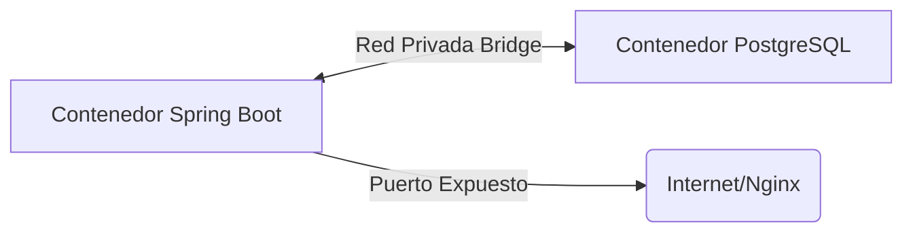

# Contenedores y Docker

Amani API está completamente "dockerizada". La paquetización de la infraestructura facilita réplicas inmediatas en cualquier entorno y previene problemas clásicos de dependencia ("en mi máquina funciona").

## Dockerfile
El código fuente incluye un `Dockerfile` que empaqueta y construye el JAR final de Spring Boot haciendo uso de compilaciones en etapas (multi-stage builds) si fuese necesario. Expone de manera unificada el puerto 8080 del artefacto final, aligerando el peso total de la imagen en base a Java JRE.

## Docker Compose
El proyecto utiliza un entorno orquestado por `docker-compose.yml` que lanza de manera entrelazada y conectada:
- **Amani API REST (app):** Base del ecosistema.
- **PostgreSQL Database:** Capa de datos con volúmenes de almacenamiento persistente (`/var/lib/postgresql/data`) para evadir pérdida accidental entre reinicios.

