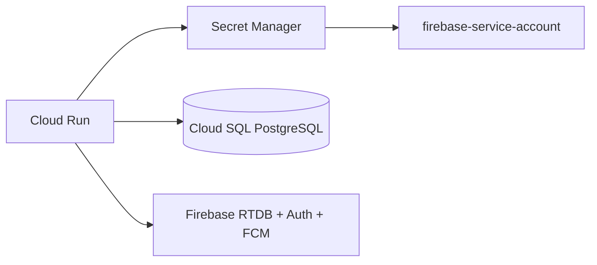

# Despliegue en GCP

Guía para desplegar AMANI API REST en Google Cloud Platform.

---

## ☁️ Arquitectura en producción



---

## 🚀 Despliegue con perfil GCP

```bash
./mvnw spring-boot:run -Dspring.profiles.active=gcp
```

### Variables de entorno requeridas

| Variable | Descripción | Ejemplo |
|---|---|---|
| `DB_URL` | URL de conexión a Cloud SQL | `jdbc:postgresql:///postgres?cloudSqlInstance=amani-160bf:europe-west1:amani-db` |
| `DB_USERNAME` | Usuario de la base de datos | `postgres` |
| `DB_PASSWORD` | Contraseña de la base de datos | (de Secret Manager) |

### Configuración automática

En perfil `gcp`:
- ✅ **ADC automático**: Cloud Run inyecta credenciales vía metadata server
- ✅ **Secret Manager**: `spring.config.import=optional:sm://firebase-service-account`
- ✅ **Firebase habilitado**: `firebase.enabled=true`
- ✅ **Firebase RTDB**: URL configurada en `application-gcp.yml`

---

## 🔐 Configurar IAM

Un **administrador** del proyecto GCP debe ejecutar este script de un solo uso:

```bash
#!/usr/bin/env bash
set -euo pipefail

PROJECT_ID="amani-160bf"
SECRET_ID="firebase-service-account"
SA_ID="firebase-secret-reader"
SA_EMAIL="${SA_ID}@${PROJECT_ID}.iam.gserviceaccount.com"

# 1. Crear Service Account
gcloud iam service-accounts create "${SA_ID}" \
    --project="${PROJECT_ID}" \
    --display-name="Lector de secreto Firebase"

# 2. Conceder acceso al secreto (mínimo privilegio)
gcloud secrets add-iam-policy-binding "${SECRET_ID}" \
    --project="${PROJECT_ID}" \
    --member="serviceAccount:${SA_EMAIL}" \
    --role="roles/secretmanager.secretAccessor"

# 3. Conceder acceso al usuario (desarrollo local)
gcloud secrets add-iam-policy-binding "${SECRET_ID}" \
    --project="${PROJECT_ID}" \
    --member="user:felixpa2001@gmail.com" \
    --role="roles/secretmanager.secretAccessor"

# 4. Verificar acceso
gcloud secrets versions access latest \
    --secret="${SECRET_ID}" --project="${PROJECT_ID}" | head -c 80

echo "✅ IAM configurado. Clave NO descargada (usar ADC en producción)."
```

---

## 🚀 Despliegue en Cloud Run

### Opción A: Workload Identity (recomendado)

1. Asignar la Service Account `firebase-secret-reader` al servicio de Cloud Run
2. No se necesitan claves JSON

```bash
gcloud run deploy amani-api \
  --source . \
  --region europe-west1 \
  --service-account firebase-secret-reader@amani-160bf.iam.gserviceaccount.com \
  --set-env-vars "SPRING_PROFILES_ACTIVE=gcp" \
  --set-secrets "DB_PASSWORD=db-password:latest"
```

### Opción B: ADC con usuario (solo para staging)

```bash
# Configurar ADC localmente
gcloud auth application-default login

# Verificar
gcloud auth application-default print-access-token
```

---

## 🔒 Seguridad

### ❌ Nunca hacer

- Subir claves JSON de Service Account al repositorio
- Usar `GOOGLE_APPLICATION_CREDENTIALS` en producción
- Asignar roles de Owner o Editor a Service Accounts
- Hardcodear secretos en `application.yml`

### ✅ Siempre hacer

- Usar ADC en GCP (automático en Cloud Run/GKE)
- Usar Workload Identity Federation para CI/CD
- Asignar `roles/secretmanager.secretAccessor` (mínimo privilegio)
- Rotar Service Account Keys si se usan localmente
- Mantener `firebase.enabled=false` en perfil local por defecto

---

## 🏥 Health Check

```bash
# En GCP
curl https://amani-api-xxxxx-ez.a.run.app/actuator/health
```

Respuesta esperada:

```json
{
  "status": "UP",
  "components": {
    "firebase": { "status": "UP", "details": { "status": "CONNECTED", "mode": "gcp" } },
    "db": { "status": "UP" }
  }
}
```

---

## 🧪 Desarrollo local con acceso a GCP

Si necesitas probar con Firebase real en local:

```bash
# Configurar ADC
gcloud auth application-default login

# Arrancar con perfil GCP
./mvnw spring-boot:run -Dspring.profiles.active=gcp
```
