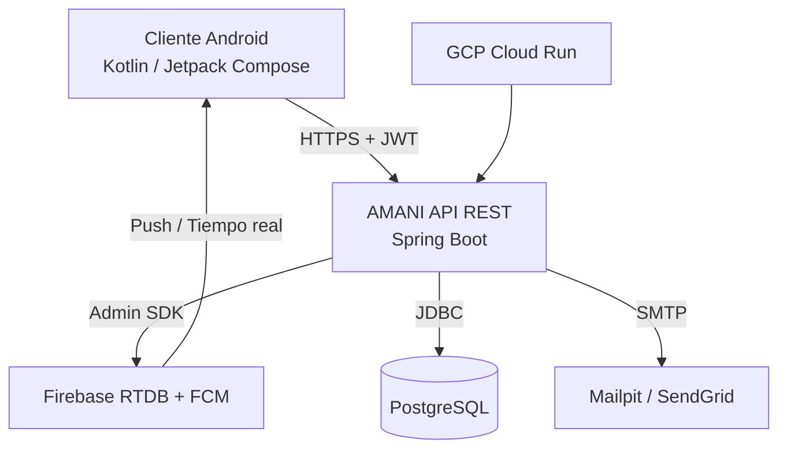

---
hide:
  - navigation
  - toc
---

# 🩺 AMANI API REST

<p align="center">
  
  
  
  
  
  
  
</p>

<p align="center">
  <strong>Plataforma de psicología clínica</strong> que conecta pacientes, psicólogos y administradores.<br/>
  API REST con mensajería en tiempo real, diario emocional, citas, historial clínico y notificaciones push.
</p>

---

## 🚀 Inicio rápido

### 1. Instalar uv

```bash
curl -LsSf https://astral.sh/uv/install.sh | sh
```

### 2. Instalar dependencias

```bash
uv sync
```

### 3. Servidor local con hot-reload

```bash
uv run mkdocs serve
```

El sitio estará disponible en `http://localhost:8000`.

---

## 📚 Secciones de la documentación

<div class="grid cards" markdown>

- :material-api: **[API REST](api/rest-api.md)**
  Referencia de endpoints, modelos de datos y especificación OpenAPI.

- :material-test-tube: **[Testing](testing/index.md)**
  Plan de pruebas, cobertura de código y problemas conocidos.

- :material-chart-line: **[Informes](reports/index.md)**
  Dashboards interactivos de tests y métricas de calidad.

- :material-book-open: **[Guías](guides/index.md)**
  Configuración local, despliegue en GCP y solución de problemas Firebase.

- :material-postman: **[Postman](postman/index.md)**
  Colección de requests para testing manual de la API.

- :material-history: **[Changelog](changelog.md)**
  Registro de cambios de integración y evolución del proyecto.

</div>

---

## 🛠 Stack Tecnológico

| Capa | Tecnología |
|---|---|
| **Lenguaje** | Java 21 |
| **Framework** | Spring Boot 4.0.3 |
| **Build** | Apache Maven |
| **ORM** | Spring Data JPA / Hibernate |
| **Base de datos** | PostgreSQL |
| **Seguridad** | Spring Security + JWT (HS256) |
| **Tiempo real** | WebSocket (STOMP sobre SockJS) |
| **Notificaciones push** | Firebase Admin SDK |
| **Email** | Spring Boot Mail (JavaMailSender) |
| **Documentación API** | SpringDoc OpenAPI / Swagger UI |

---

## 🏗 Arquitectura de alto nivel



---

## 📂 Repositorios relacionados

- [amani-apirest](https://github.com/AmaniGrupo1/amani-apirest) — Backend (este repo)
- [AmaniAndroid](https://github.com/AmaniGrupo1/AmaniAndroid) — Cliente Android

---

## 📄 Licencia

Proyecto privado. Todos los derechos reservados © 2026 Amani Team.
