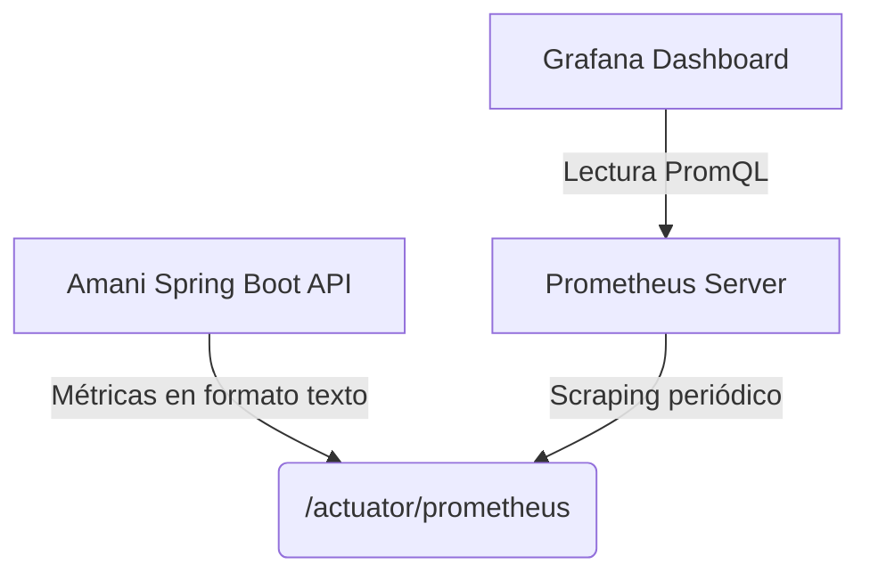

# Observabilidad y Monitoreo

La salud operacional y de infraestructura de la API es expuesta a través de un esquema centralizado de monitorización basado en el stack de Prometheus.

## Actuators de Spring Boot
Los indicadores clave se derivan nativamente desde `spring-boot-starter-actuator`, el cual se encarga de recopilar y exponer telemetría sin acoplamiento con la lógica de negocio.
Endpoints críticos expuestos bajo `/actuator/`:
- `/health`: Estado base de la aplicación.
- `/prometheus`: Formato estandarizado para ingesta del pull.

## Stack Prometheus & Grafana
El proyecto incorpora un archivo `docker-compose.monitoring.yml` en la raíz.

Este ecosistema permite configurar alertas automatizadas y observar métricas sobre la latencia en las consultas JDBC, tiempo de respuesta de los endpoints, uso de CPU, o conteo de errores HTTP 500, dotando de total visibilidad a los DevOps.
